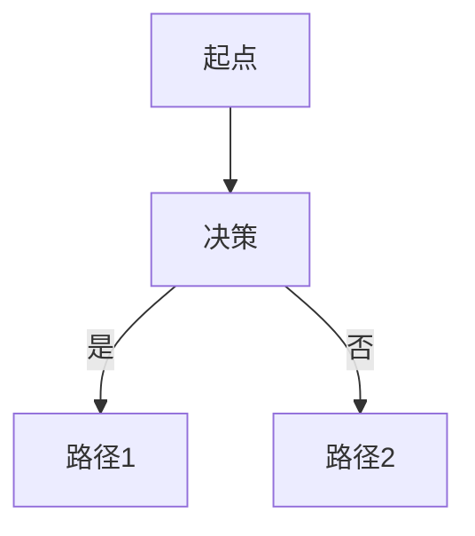

# 快速参考卡

## 三条最常用命令

```bash
npx quartz build --serve     # 本地预览（http://localhost:8080）
npx quartz sync              # 一键同步发布到 GitHub
npx quartz update            # 升级 Quartz 本身
```

## Markdown 速查

```markdown
# H1（一篇笔记只用一个）
## H2
### H3

**加粗** *斜体* ~~删除线~~

- 无序列表
1. 有序列表

> 引用块

`行内代码`

```python
# 代码块
print("hello")
```

[链接文字](https://url.com)


| 表头 | 表头 |
|------|------|
| 单元 | 单元 |

[[双向链接]]
[[笔记名|显示文字]]
#标签
```

## Frontmatter 规范

每篇笔记开头必须有：

```yaml
---
title: 标题
date: 2026-05-05
tags:
  - 标签1
  - 标签2
---
```

可选字段：

```yaml
draft: true              # 不发布
publish: false           # 同上
aliases: ["别名1"]        # 用于 [[别名1]] 链接到本笔记
description: 摘要        # 列表页显示
```

## Mermaid 图（直接嵌入）



## 数学公式

行内：`$E = mc^2$`
块级：`$$\sum_{i=1}^n x_i$$`

## 常见踩坑

| 现象 | 原因 | 修复 |
|------|------|------|
| 双向链接显示 ❌ 红色 | 目标笔记不存在 | 创建该笔记，或检查文件名 |
| 中文文件名打不开 | 编码问题 | 用英文/拼音命名，title 用中文 |
| 图片不显示 | 路径错 | 放在 content/assets/ 下，用 `` |
| Push 失败 | 默认分支不是 v4 | `git checkout -b v4 && git push -u origin v4` |
