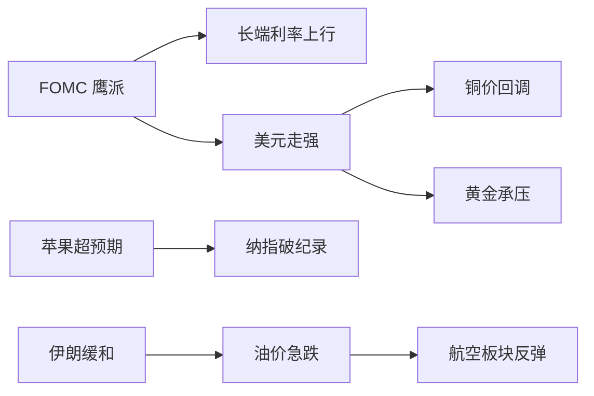

> **一周关键词**：FOMC 鹰派、铜价回调、苹果财报超预期、伊朗局势缓和

## 1. 本周大事

1. **FOMC 5/1 决议**：维持利率不变，鲍威尔记者会基调偏鹰，长端利率上行 X bp
2. **苹果 Q2 财报**：营收 $111.2B（YoY +17%），EPS $2.01（+22%），Q3 指引 +14-17% 远超预期 +9.5%
3. **伊朗通过巴基斯坦中介递交新和平方案**，油价急跌近 3%
4. **FCX Q1 不及预期**，矿业板块整体回调（详见 [[示例-FCX-2026-Q1]]）

## 2. 跨资产联动

关键观察：本周走出**鹰派联储 + 鹰派央行预期 + 长端利率上行**的组合，但科技股因苹果业绩对冲了这一压力。**矿业、能源**承压最显著。

## 3. 持仓变动

- 减仓：能源板块 X%（兑现部分浮盈）
- 加仓：[[示例-FCX-2026-Q1]] 首仓 X%，逻辑见个股报告
- 观察：航空板块尚未行动

## 4. 下周关注

| 日期 | 事件 |
|------|------|
| 5/6 周二 | 服务业 PMI |
| 5/7 周三 | NVDA 财报后续解读 |
| 5/9 周五 | 5月密歇根消费者信心 |

## 5. 复盘反思

上周判断"FOMC 偏鹰但长端利率敏感性下降"——结果鹰派程度超预期，长端反应也比想象大。修正方向：**对长端利率的中枢判断需上调约 X bp**。

## 关联

- 个股决策：[[示例-FCX-2026-Q1]]
- 框架：[[Agent Team投研框架]]
- 上周对比：周报-2026-W17（待写）
